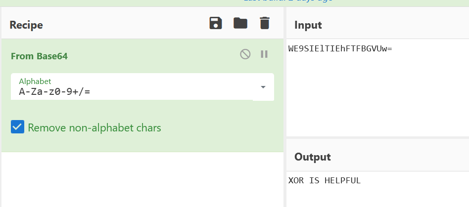
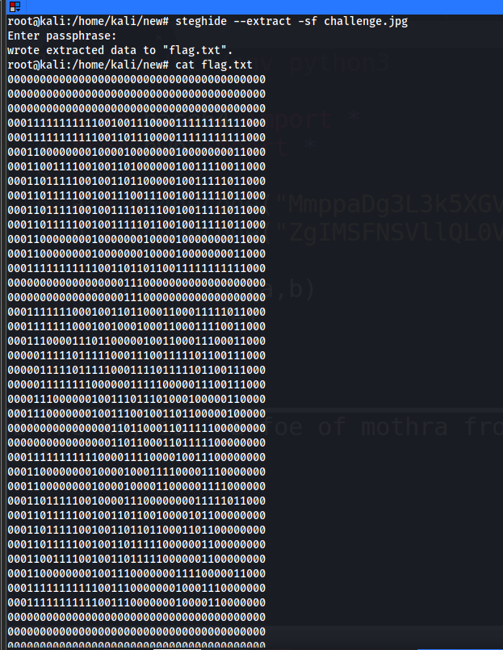

## Solution

We get a file called challenge.jpg

First check the meta data of the image
```
ExifTool Version Number         : 12.16
File Name                       : challenge.jpg
Directory                       : .
File Size                       : 623 KiB
File Modification Date/Time     : 2021:02:19 02:07:33-05:00
File Access Date/Time           : 2021:02:19 02:07:38-05:00
File Inode Change Date/Time     : 2021:02:19 02:07:33-05:00
File Permissions                : rw-r--r--
File Type                       : JPEG
File Type Extension             : jpg
MIME Type                       : image/jpeg
JFIF Version                    : 1.01
Resolution Unit                 : inches
X Resolution                    : 96
Y Resolution                    : 96
Exif Byte Order                 : Big-endian (Motorola, MM)
Artist                          : MmppaDg3L3k5XGVxL24zcjNzDG1sbWVcbGZuXGVuZnI5
Copyright                       : ZgIMSFNSVllQL0VcDw8TFFwWLAIKTQgzGA4cPUUIFB1UEg0GDEJeQxVY
XP Comment                      : WE9SIElTIEhFTFBGVUw=
XP Author                       : MmppaDg3L3k5XGVxL24zcjNzDG1sbWVcbGZuXGVuZnI5
Padding                         : (Binary data 1582 bytes, use -b option to extract)
About                           : uuid:faf5bdd5-ba3d-11da-ad31-d33d75182f1b
Rating                          : 2
Warning                         : [minor] Fixed incorrect URI for xmlns:MicrosoftPhoto
Rating Percent                  : 25
Creator                         : MmppaDg3L3k5XGVxL24zcjNzDG1sbWVcbGZuXGVuZnI5
Rights                          : ZgIMSFNSVllQL0VcDw8TFFwWLAIKTQgzGA4cPUUIFB1UEg0GDEJeQxVY
Image Width                     : 4000
Image Height                    : 2546
Encoding Process                : Baseline DCT, Huffman coding
Bits Per Sample                 : 8
Color Components                : 3
Y Cb Cr Sub Sampling            : YCbCr4:2:0 (2 2)
Image Size                      : 4000x2546
Megapixels                      : 10.2
```
It should have a bunch of base64 but if you notice carefully you will have 3 base64 strings repeated ....
so decoding them you will get only one hit which is 



So the hint is ```XOR is helpful``` and the data would be the other base64 strings. One will act as the string and other will act as the key
and it is obvious because their is no other data, image that we can perform xor with. I will use python but their are online tools available that will help you 
with this. Here is my solution


You can google ```a foe of mothra from godzilla``` and you will find the key is ```Ghidorah```

The key can be used with steghide to extract hidden files from the image so doing that



It's like I have hidden a QR code in a binary data. You can google about this technique you will get a decoder with few google searches 

```https://www.dcode.fr/binary-image``` is the resource i have used but their can be others to do this
So go to the site and decode the binary txt and you will get a QR code . Scan that code you will have the flag

Flag: ```flag{y0u_d1d_1t}```

Hope you have learned something new with this!!!


